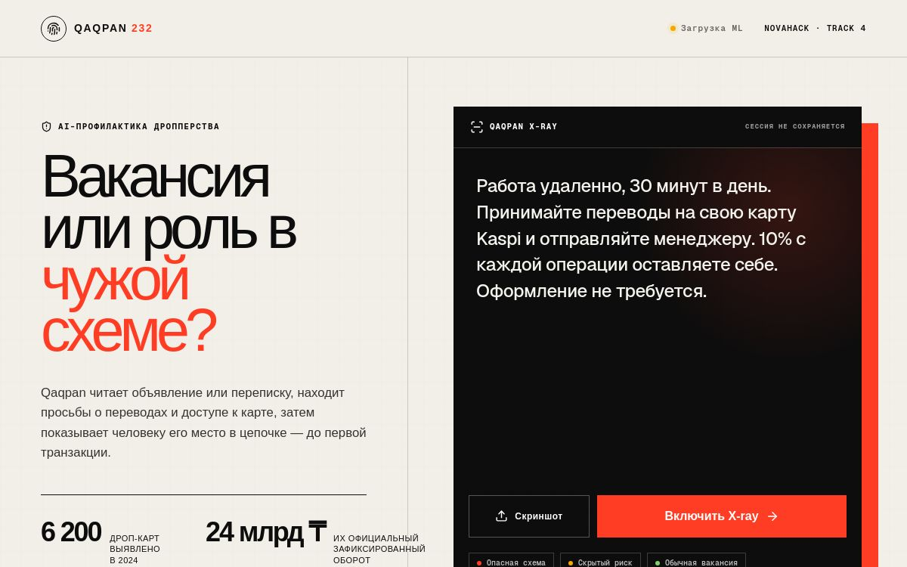

# Qaqpan 232

**Русский** | [English](README.en.md)

**NovaHack 2026 · Track 4: Sustainable & Social Future**

**Команда:** Sigmabeki  
**Рабочий сайт:** https://qaqpan-232.osprey-shed6h9b8p81a.chatgpt.site  
**Презентация:** [`docs/Qaqpan_232_NovaHack.pptx`](docs/Qaqpan_232_NovaHack.pptx)

Qaqpan 232 проверяет вакансии и переписки на признаки вербовки в дропперские схемы. Пользователь вставляет текст или загружает скриншот. Сервис показывает подозрительные фразы, возможную схему движения денег и безопасный следующий шаг.

Qaqpan предупреждает о риске. Он не обвиняет работодателя и не заменяет банк, полицию или юридическую консультацию.



## Зачем нужен проект

Вербовка дропперов часто выглядит как обычная удалённая работа. Человеку предлагают принять деньги на личную карту, оставить процент и отправить остаток менеджеру. На этом этапе он ещё может остановиться. После первого перевода сделать это сложнее.

Qaqpan рассчитан на школьников, студентов и молодых соискателей. Его также можно использовать в вузах, центрах занятости, на сайтах вакансий и в программах финансовой грамотности.

Проблема подтверждается официальными данными Казахстана:

- В 2024 году выявили **6 200 дроп-карт**. Их оборот составил **24 млрд тенге**. [Источник: АРРФР и АФМ](https://www.gov.kz/memleket/entities/ardfm/press/news/details/1065183?lang=ru)
- Антифрод-центр Национального банка зарегистрировал **более 60 000 инцидентов за 10 месяцев**. [Источник: Национальный банк Казахстана](https://nationalbank.kz/ru/news/informacionnye-soobshcheniya/17702)
- С 16 сентября 2025 года в Казахстане действует статья 232-1 УК. Наказание зависит от обстоятельств и может достигать семи лет лишения свободы. [Официальное разъяснение](https://www.gov.kz/memleket/entities/qriim/press/news/details/1068462?lang=ru)

## Что умеет MVP

- проверяет вставленный текст;
- распознаёт русский и казахский текст на скриншоте;
- находит просьбы принять или переслать деньги;
- замечает запросы карты, PIN, CVV, SMS-кодов и доступа к банкингу;
- показывает найденные фразы;
- объясняет возможную схему движения денег;
- предлагает безопасные действия;
- работает без регистрации и платного API.

Сообщения не записываются в серверную базу. Текст анализируется в браузере.

## Как работает анализ

1. Tesseract.js распознаёт текст на скриншоте.
2. TF-IDF превращает части слов в числовые признаки.
3. Logistic Regression оценивает сходство с рискованными примерами.
4. Набор правил проверяет конкретные действия с картой, деньгами и банковскими данными.
5. Пользователь получает индекс риска, найденные фразы и список действий.

Модель использует части слов длиной от трёх до пяти символов. Это помогает работать с опечатками, сленгом, смешением языков и ошибками OCR.

Индекс от 0 до 100 не показывает вероятность преступления. Это сумма признаков риска в тексте.

## Данные и тест

В `data/offers.csv` находятся 256 учебных примеров на русском и казахском языках. Мы составили их по схемам из официальных предупреждений. Реальные переписки пострадавших не использовались.

Похожие варианты одного сообщения не попадают одновременно в обучение и тест. Например, если модель училась на одном шаблоне вакансии, изменённая версия того же шаблона не появляется на экзамене. Такой способ проверки называется group holdout.

В тестовой части было 68 сообщений:

- 44 рискованных;
- 24 безопасных;
- система нашла 34 из 44 рискованных;
- система пропустила 10 рискованных;
- ни одно безопасное сообщение не было отмечено как рискованное;
- итоговый F1 составил **0,872**.

Это результат на небольшом учебном наборе. Он показывает, что механика MVP работает, но не доказывает точность на реальных данных.

## Стек

- React 19, TypeScript и Vinext;
- Tesseract.js;
- Python и scikit-learn;
- TF-IDF и Logistic Regression;
- JSON-модель для работы в браузере;
- Lucide React.

## Структура

```text
app/page.tsx             интерфейс и OCR
app/lib/analyzer.ts      анализ текста и правила риска
scripts/train_model.py   обучение и экспорт модели
data/offers.csv          учебные примеры RU/KZ
data/README.md           описание данных
artifacts/metrics.json   результаты теста
public/model.json        модель для браузера
tests/                   проверки проекта
docs/                    презентация
```

## Запуск

Нужен Node.js 22.13 или новее.

```bash
git clone https://github.com/pablo228sos/qaqpan-232.git
cd qaqpan-232
npm ci
npm run dev
```

Проверка проекта:

```bash
npm run lint
npm test
```

Для повторного обучения модели нужен Python 3.11 или новее:

```bash
python -m pip install scikit-learn numpy
python scripts/train_model.py
```

## Участие в разработке

Qaqpan 232 развивается как открытый проект под MIT License. Мы принимаем содержательные улучшения детектора, тестов, оценки модели, русского и казахского языков, accessibility, документации и инфраструктуры.

Для первого вклада смотри задачи с labels **good first issue** и **help wanted**. Перед началом более крупной задачи лучше оставить комментарий в issue, чтобы два человека не делали одну и ту же работу.

Полные правила и запуск для контрибьюторов находятся в [`CONTRIBUTING.md`](CONTRIBUTING.md). Уязвимости и security-sensitive находки нужно отправлять по [`SECURITY.md`](SECURITY.md), а не публиковать в обычном issue.

Не принимаются сгенерированный filler, дубликаты, массовые typo-PR, приватные переписки, credentials и изменения, сделанные только ради contribution count.

## Ограничения

- Данные синтетические и не заменяют тест на реальных обращениях.
- Низкий индекс не гарантирует безопасность вакансии.
- Высокий индекс не доказывает вину работодателя.
- Для проверки БИН нужен официальный источник данных.
- Перед реальным запуском нужны анонимизированные сообщения, независимая разметка и отдельная проверка русского и казахского языков.

## Следующие шаги

1. Собрать анонимизированные реальные сообщения с согласия пользователей.
2. Провести независимую разметку.
3. Добавить проверку БИН и контактов работодателя.
4. Проверить модель отдельно на русском, казахском и смешанном тексте.
5. Сделать Telegram Mini App и виджет для сайтов вакансий.

## Команда

**Sigmabeki**

- Saitov Saidzhan
- Bakasov Abai
- Dzhangaziev Daniyar
- Kurmanbekov Chingiz

## Лицензия

Проект распространяется по [MIT License](LICENSE).
